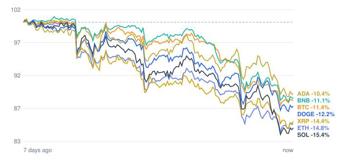

# Crypto Daily Report

An automated daily review of the crypto market. Every morning at about 09:00 (Berlin time) a
GitHub Actions workflow fetches prices from the public [CoinGecko API](https://www.coingecko.com/en/api),
writes a Markdown report with a 7-day chart, appends the numbers to a CSV history and updates this page.

The commits labelled `chore(bot): daily market report` are made by that workflow, not by hand.

## Latest report

<!-- LATEST:START -->
### 2026-11-14

- **Total crypto market cap:** €2.07 T (▼ -5.76% in 24h, measured in USD)
- **Bitcoin dominance:** 58.7%
- **Best of the tracked coins (24h):** XRP ▼ -3.51%
- **Weakest of the tracked coins (24h):** Solana ▼ -7.28%
- **Week:** 0 of 7 tracked coins are up over 7 days.

| Coin | Price | 24h | 7d | 7d range | Market cap |
|---|---:|---:|---:|---:|---:|
| Bitcoin (BTC) | €60,587.00 | ▼ -3.78% | ▼ -11.87% | €60,498.46 – €68,930.84 | €1.22 T |
| Ethereum (ETH) | €1,716.40 | ▼ -3.76% | ▼ -15.40% | €1,707.49 – €2,036.19 | €209.8 B |
| BNB (BNB) | €551.43 | ▼ -5.42% | ▼ -11.54% | €556.76 – €634.46 | €72.5 B |
| XRP (XRP) | €0.9037 | ▼ -3.51% | ▼ -15.39% | €0.8909 – €1.06 | €57.4 B |
| Solana (SOL) | €68.57 | ▼ -7.28% | ▼ -15.97% | €68.08 – €81.57 | €40.6 B |
| Dogecoin (DOGE) | €0.0568 | ▼ -5.18% | ▼ -12.83% | €0.0566 – €0.0653 | €8.9 B |
| Cardano (ADA) | €0.1464 | ▼ -6.95% | ▼ -11.60% | €0.1476 – €0.1658 | €5.5 B |



**Recent reports:** [2026-11-14](reports/2026/11/2026-11-14.md) · [2026-11-13](reports/2026/11/2026-11-13.md) · [2026-11-12](reports/2026/11/2026-11-12.md) · [2026-11-11](reports/2026/11/2026-11-11.md) · [2026-11-10](reports/2026/11/2026-11-10.md) · [2026-11-09](reports/2026/11/2026-11-09.md) · [2026-11-08](reports/2026/11/2026-11-08.md)
<!-- LATEST:END -->

## How it works

**Trigger:** a scheduled workflow ([`.github/workflows/daily-report.yml`](.github/workflows/daily-report.yml))
starts at 07:00 and 08:00 UTC. A gate step only lets the run continue from 09:00 Berlin time, which
keeps the time right in both summer and winter. It can also be started by hand under *Actions → Run workflow*.

**Inputs:** current prices, 24h and 7-day changes and 7-day price curves for Bitcoin, Ethereum,
Solana, BNB, XRP, Cardano and Dogecoin in EUR, plus total market data.

**What happens:** the unit tests run first. Then [`report.py`](report.py) (Python standard library
only) fetches the data, builds the summary and table and draws the chart as an SVG. A second run
on the same day does nothing.

**Outputs:**

| Path | Content |
|---|---|
| `reports/YYYY/MM/YYYY-MM-DD.md` | the day's report |
| `charts/YYYY-MM-DD.svg` | 7-day performance, each coin indexed to 100 |
| `data/history.csv` | one row per coin per day, for later analysis |
| `README.md` | the latest report section above |

## Run it locally

```bash
python -m unittest discover tests
python report.py          # FORCE=1 python report.py to rebuild today's report
```

An optional free CoinGecko demo key can be added as the repository secret `COINGECKO_API_KEY`
if the public API starts rate-limiting the runner.

## Disclaimer

This is an automated data summary for learning purposes. It is not financial advice.

## License

[MIT](LICENSE)
