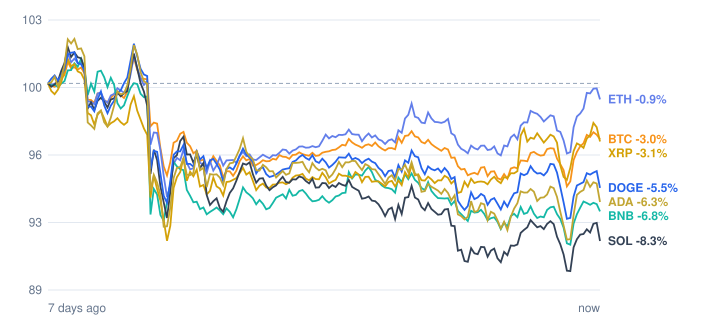

# Crypto Daily Report

An automated daily review of the crypto market. Every morning at about 09:00 (Berlin time) a
GitHub Actions workflow fetches prices from the public [CoinGecko API](https://www.coingecko.com/en/api),
writes a Markdown report with a 7-day chart, appends the numbers to a CSV history and updates this page.

The commits labelled `chore(bot): daily market report` are made by that workflow, not by hand.

## Latest report

<!-- LATEST:START -->
### 2026-11-04

- **Total crypto market cap:** €2.38 T (▼ -0.28% in 24h, measured in USD)
- **Bitcoin dominance:** 59.4%
- **Best of the tracked coins (24h):** Ethereum ▲ +3.17%
- **Weakest of the tracked coins (24h):** BNB ▲ +0.92%
- **Week:** 0 of 7 tracked coins are up over 7 days.

| Coin | Price | 24h | 7d | 7d range | Market cap |
|---|---:|---:|---:|---:|---:|
| Bitcoin (BTC) | €70,371.00 | ▲ +1.96% | ▼ -2.94% | €67,742.61 – €72,626.24 | €1.41 T |
| Ethereum (ETH) | €2,105.29 | ▲ +3.17% | ▼ -0.86% | €1,948.42 – €2,106.29 | €257.2 B |
| BNB (BNB) | €629.11 | ▲ +0.92% | ▼ -7.13% | €609.25 – €674.84 | €82.7 B |
| XRP (XRP) | €1.16 | ▲ +2.01% | ▼ -2.58% | €1.07 – €1.19 | €73.7 B |
| Solana (SOL) | €84.31 | ▲ +1.18% | ▼ -8.48% | €80.85 – €91.49 | €49.8 B |
| Dogecoin (DOGE) | €0.0679 | ▲ +1.20% | ▼ -5.62% | €0.0651 – €0.0716 | €10.6 B |
| Cardano (ADA) | €0.1735 | ▲ +2.01% | ▼ -6.43% | €0.1648 – €0.1839 | €6.5 B |



**Recent reports:** [2026-11-04](reports/2026/11/2026-11-04.md) · [2026-11-03](reports/2026/11/2026-11-03.md) · [2026-11-02](reports/2026/11/2026-11-02.md) · [2026-11-01](reports/2026/11/2026-11-01.md) · [2026-10-31](reports/2026/10/2026-10-31.md) · [2026-10-30](reports/2026/10/2026-10-30.md) · [2026-10-29](reports/2026/10/2026-10-29.md)
<!-- LATEST:END -->

## How it works

**Trigger:** a scheduled workflow ([`.github/workflows/daily-report.yml`](.github/workflows/daily-report.yml))
starts at 07:00 and 08:00 UTC. A gate step only lets the run continue from 09:00 Berlin time, which
keeps the time right in both summer and winter. It can also be started by hand under *Actions → Run workflow*.

**Inputs:** current prices, 24h and 7-day changes and 7-day price curves for Bitcoin, Ethereum,
Solana, BNB, XRP, Cardano and Dogecoin in EUR, plus total market data.

**What happens:** the unit tests run first. Then [`report.py`](report.py) (Python standard library
only) fetches the data, builds the summary and table and draws the chart as an SVG. A second run
on the same day does nothing.

**Outputs:**

| Path | Content |
|---|---|
| `reports/YYYY/MM/YYYY-MM-DD.md` | the day's report |
| `charts/YYYY-MM-DD.svg` | 7-day performance, each coin indexed to 100 |
| `data/history.csv` | one row per coin per day, for later analysis |
| `README.md` | the latest report section above |

## Run it locally

```bash
python -m unittest discover tests
python report.py          # FORCE=1 python report.py to rebuild today's report
```

An optional free CoinGecko demo key can be added as the repository secret `COINGECKO_API_KEY`
if the public API starts rate-limiting the runner.

## Disclaimer

This is an automated data summary for learning purposes. It is not financial advice.

## License

[MIT](LICENSE)
