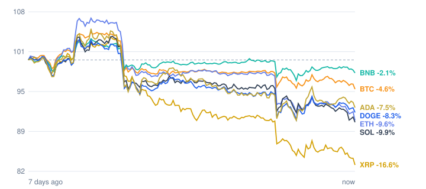

# Crypto Daily Report

An automated daily review of the crypto market. Every morning at about 09:00 (Berlin time) a
GitHub Actions workflow fetches prices from the public [CoinGecko API](https://www.coingecko.com/en/api),
writes a Markdown report with a 7-day chart, appends the numbers to a CSV history and updates this page.

The commits labelled `chore(bot): daily market report` are made by that workflow, not by hand.

## Latest report

<!-- LATEST:START -->
### 2026-11-10

- **Total crypto market cap:** €2.23 T (▼ -3.59% in 24h, measured in USD)
- **Bitcoin dominance:** 59.7%
- **Best of the tracked coins (24h):** BNB ▲ +0.03%
- **Weakest of the tracked coins (24h):** XRP ▼ -3.77%
- **Week:** 0 of 7 tracked coins are up over 7 days.

| Coin | Price | 24h | 7d | 7d range | Market cap |
|---|---:|---:|---:|---:|---:|
| Bitcoin (BTC) | €66,444.00 | ▼ -0.81% | ▼ -3.91% | €65,933.49 – €72,164.29 | €1.34 T |
| Ethereum (ETH) | €1,853.31 | ▼ -2.66% | ▼ -8.96% | €1,847.28 – €2,178.17 | €226.5 B |
| BNB (BNB) | €615.03 | ▲ +0.03% | ▼ -1.37% | €604.05 – €645.37 | €80.9 B |
| XRP (XRP) | €0.9473 | ▼ -3.77% | ▼ -17.37% | €0.9523 – €1.18 | €60.2 B |
| Solana (SOL) | €75.38 | ▼ -3.57% | ▼ -9.68% | €75.22 – €86.58 | €44.6 B |
| Dogecoin (DOGE) | €0.0619 | ▼ -1.43% | ▼ -7.74% | €0.0609 – €0.0694 | €9.7 B |
| Cardano (ADA) | €0.1584 | ▼ -2.27% | ▼ -7.03% | €0.1541 – €0.1788 | €6.0 B |



**Recent reports:** [2026-11-10](reports/2026/11/2026-11-10.md) · [2026-11-09](reports/2026/11/2026-11-09.md) · [2026-11-08](reports/2026/11/2026-11-08.md) · [2026-11-07](reports/2026/11/2026-11-07.md) · [2026-11-06](reports/2026/11/2026-11-06.md) · [2026-11-05](reports/2026/11/2026-11-05.md) · [2026-11-04](reports/2026/11/2026-11-04.md)
<!-- LATEST:END -->

## How it works

**Trigger:** a scheduled workflow ([`.github/workflows/daily-report.yml`](.github/workflows/daily-report.yml))
starts at 07:00 and 08:00 UTC. A gate step only lets the run continue from 09:00 Berlin time, which
keeps the time right in both summer and winter. It can also be started by hand under *Actions → Run workflow*.

**Inputs:** current prices, 24h and 7-day changes and 7-day price curves for Bitcoin, Ethereum,
Solana, BNB, XRP, Cardano and Dogecoin in EUR, plus total market data.

**What happens:** the unit tests run first. Then [`report.py`](report.py) (Python standard library
only) fetches the data, builds the summary and table and draws the chart as an SVG. A second run
on the same day does nothing.

**Outputs:**

| Path | Content |
|---|---|
| `reports/YYYY/MM/YYYY-MM-DD.md` | the day's report |
| `charts/YYYY-MM-DD.svg` | 7-day performance, each coin indexed to 100 |
| `data/history.csv` | one row per coin per day, for later analysis |
| `README.md` | the latest report section above |

## Run it locally

```bash
python -m unittest discover tests
python report.py          # FORCE=1 python report.py to rebuild today's report
```

An optional free CoinGecko demo key can be added as the repository secret `COINGECKO_API_KEY`
if the public API starts rate-limiting the runner.

## Disclaimer

This is an automated data summary for learning purposes. It is not financial advice.

## License

[MIT](LICENSE)
