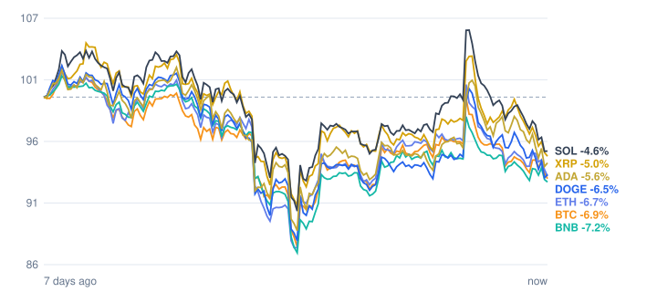

# Crypto Daily Report

An automated daily review of the crypto market. Every morning at about 09:00 (Berlin time) a
GitHub Actions workflow fetches prices from the public [CoinGecko API](https://www.coingecko.com/en/api),
writes a Markdown report with a 7-day chart, appends the numbers to a CSV history and updates this page.

The commits labelled `chore(bot): daily market report` are made by that workflow, not by hand.

## Latest report

<!-- LATEST:START -->
### 2026-11-24

- **Total crypto market cap:** €1.90 T (▼ -5.12% in 24h, measured in USD)
- **Bitcoin dominance:** 57.9%
- **Best of the tracked coins (24h):** BNB ▼ -2.73%
- **Weakest of the tracked coins (24h):** Solana ▼ -6.18%
- **Week:** 0 of 7 tracked coins are up over 7 days.

| Coin | Price | 24h | 7d | 7d range | Market cap |
|---|---:|---:|---:|---:|---:|
| Bitcoin (BTC) | €54,730.00 | ▼ -3.22% | ▼ -5.75% | €50,791.99 – €59,159.52 | €1.10 T |
| Ethereum (ETH) | €1,534.71 | ▼ -4.27% | ▼ -5.26% | €1,421.34 – €1,661.98 | €187.6 B |
| BNB (BNB) | €501.52 | ▼ -2.73% | ▼ -5.95% | €464.36 – €544.15 | €65.9 B |
| XRP (XRP) | €0.8416 | ▼ -3.81% | ▼ -3.46% | €0.7939 – €0.9134 | €53.4 B |
| Solana (SOL) | €63.43 | ▼ -6.18% | ▼ -3.41% | €59.58 – €69.65 | €37.5 B |
| Dogecoin (DOGE) | €0.0504 | ▼ -4.31% | ▼ -4.82% | €0.0469 – €0.0548 | €7.9 B |
| Cardano (ADA) | €0.1325 | ▼ -4.30% | ▼ -3.81% | €0.1228 – €0.1419 | €5.0 B |



**Recent reports:** [2026-11-24](reports/2026/11/2026-11-24.md) · [2026-11-23](reports/2026/11/2026-11-23.md) · [2026-11-22](reports/2026/11/2026-11-22.md) · [2026-11-21](reports/2026/11/2026-11-21.md) · [2026-11-20](reports/2026/11/2026-11-20.md) · [2026-11-19](reports/2026/11/2026-11-19.md) · [2026-11-18](reports/2026/11/2026-11-18.md)
<!-- LATEST:END -->

## How it works

**Trigger:** a scheduled workflow ([`.github/workflows/daily-report.yml`](.github/workflows/daily-report.yml))
starts at 07:00 and 08:00 UTC. A gate step only lets the run continue from 09:00 Berlin time, which
keeps the time right in both summer and winter. It can also be started by hand under *Actions → Run workflow*.

**Inputs:** current prices, 24h and 7-day changes and 7-day price curves for Bitcoin, Ethereum,
Solana, BNB, XRP, Cardano and Dogecoin in EUR, plus total market data.

**What happens:** the unit tests run first. Then [`report.py`](report.py) (Python standard library
only) fetches the data, builds the summary and table and draws the chart as an SVG. A second run
on the same day does nothing.

**Outputs:**

| Path | Content |
|---|---|
| `reports/YYYY/MM/YYYY-MM-DD.md` | the day's report |
| `charts/YYYY-MM-DD.svg` | 7-day performance, each coin indexed to 100 |
| `data/history.csv` | one row per coin per day, for later analysis |
| `README.md` | the latest report section above |

## Run it locally

```bash
python -m unittest discover tests
python report.py          # FORCE=1 python report.py to rebuild today's report
```

An optional free CoinGecko demo key can be added as the repository secret `COINGECKO_API_KEY`
if the public API starts rate-limiting the runner.

## Disclaimer

This is an automated data summary for learning purposes. It is not financial advice.

## License

[MIT](LICENSE)
