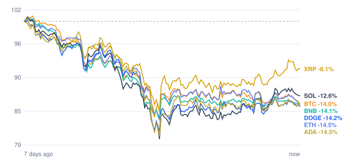

# Crypto Daily Report

An automated daily review of the crypto market. Every morning at about 09:00 (Berlin time) a
GitHub Actions workflow fetches prices from the public [CoinGecko API](https://www.coingecko.com/en/api),
writes a Markdown report with a 7-day chart, appends the numbers to a CSV history and updates this page.

The commits labelled `chore(bot): daily market report` are made by that workflow, not by hand.

## Latest report

<!-- LATEST:START -->
### 2026-11-18

- **Total crypto market cap:** €1.98 T (▼ -3.66% in 24h, measured in USD)
- **Bitcoin dominance:** 58.1%
- **Best of the tracked coins (24h):** XRP ▲ +1.75%
- **Weakest of the tracked coins (24h):** Bitcoin ▼ -1.48%
- **Week:** 0 of 7 tracked coins are up over 7 days.

| Coin | Price | 24h | 7d | 7d range | Market cap |
|---|---:|---:|---:|---:|---:|
| Bitcoin (BTC) | €57,457.00 | ▼ -1.48% | ▼ -14.08% | €57,095.65 – €68,037.96 | €1.16 T |
| Ethereum (ETH) | €1,609.90 | ▼ -0.88% | ▼ -13.85% | €1,576.84 – €1,905.36 | €196.8 B |
| BNB (BNB) | €530.20 | ▼ -0.74% | ▼ -14.35% | €520.82 – €626.70 | €69.7 B |
| XRP (XRP) | €0.8893 | ▲ +1.75% | ▼ -7.40% | €0.8189 – €0.9775 | €56.5 B |
| Solana (SOL) | €66.84 | ▲ +1.37% | ▼ -12.40% | €61.88 – €77.77 | €39.6 B |
| Dogecoin (DOGE) | €0.0535 | ▲ +0.68% | ▼ -13.65% | €0.0512 – €0.0630 | €8.4 B |
| Cardano (ADA) | €0.1375 | ▼ -0.65% | ▼ -14.63% | €0.1311 – €0.1635 | €5.2 B |



**Recent reports:** [2026-11-18](reports/2026/11/2026-11-18.md) · [2026-11-17](reports/2026/11/2026-11-17.md) · [2026-11-16](reports/2026/11/2026-11-16.md) · [2026-11-15](reports/2026/11/2026-11-15.md) · [2026-11-14](reports/2026/11/2026-11-14.md) · [2026-11-13](reports/2026/11/2026-11-13.md) · [2026-11-12](reports/2026/11/2026-11-12.md)
<!-- LATEST:END -->

## How it works

**Trigger:** a scheduled workflow ([`.github/workflows/daily-report.yml`](.github/workflows/daily-report.yml))
starts at 07:00 and 08:00 UTC. A gate step only lets the run continue from 09:00 Berlin time, which
keeps the time right in both summer and winter. It can also be started by hand under *Actions → Run workflow*.

**Inputs:** current prices, 24h and 7-day changes and 7-day price curves for Bitcoin, Ethereum,
Solana, BNB, XRP, Cardano and Dogecoin in EUR, plus total market data.

**What happens:** the unit tests run first. Then [`report.py`](report.py) (Python standard library
only) fetches the data, builds the summary and table and draws the chart as an SVG. A second run
on the same day does nothing.

**Outputs:**

| Path | Content |
|---|---|
| `reports/YYYY/MM/YYYY-MM-DD.md` | the day's report |
| `charts/YYYY-MM-DD.svg` | 7-day performance, each coin indexed to 100 |
| `data/history.csv` | one row per coin per day, for later analysis |
| `README.md` | the latest report section above |

## Run it locally

```bash
python -m unittest discover tests
python report.py          # FORCE=1 python report.py to rebuild today's report
```

An optional free CoinGecko demo key can be added as the repository secret `COINGECKO_API_KEY`
if the public API starts rate-limiting the runner.

## Disclaimer

This is an automated data summary for learning purposes. It is not financial advice.

## License

[MIT](LICENSE)
